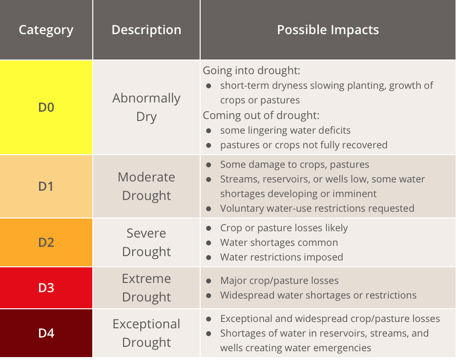

# Introduction
**Texas is no stranger to drought.**  (Waterdatafortexas.org, 2017) 

Texas is the second-largest state in the United States with a total area of 268,596 sq. miles (Texasalmanac.com, 2017). Such a large embodiment with drought affected area is difficult to conceptualize without a visual representation. As a result, spatial and temporal visualization would improve information visibility on the intensity of the drought’s implication on the area throughout Texas. Hence, the purpose for this project is to demonstrate the severity and distribution of drought by visualizing U.S. Drought Monitor data. 

Texas has experienced several droughts in recent decade, including the most recent and most severe drought that began in 2011. Its' rapidly growing population increasingly demand for more water (Twdb.texas.gov, 2017). Adding to the severity, climate change has also intensified the spike in water requirements demanding an effective solution for state’s water situation (Epa.gov, 2017). The visualization will realize the temporal changes through annual series.


Lastly, two prevalent factors have identified that contributed to the dry phenomenon directly, which is temperature and precipitation (Geochange.er.usgs.gov, 2017). The feature question of which factor is more impactful will be attempted to be visually represented for knowledge discovery. The correlational statistics will be produced with the spread of drought area and compared.
<br>


# Methodology: Packages, data and preprocessing {.tabset .tabset-fade}

## Required packages

```{r package loading, message =FALSE,results='hide'}
# packages installment
library(rmarkdown)
library(gridExtra)
library(ggplot2)
library(rgdal)
library(dplyr)
library(DT)
library(leaflet)
library(weathermetrics)
library(xts)
library(htmlwidgets)
library(widgetframe)
library(dygraphs)
library(zoo)
library(tigris)
knitr::opts_chunk$set(cache=TRUE)
```
<br>


## Data
1. Texas boundary shape file

The shape file was downloaded from [Census Bureau's MAF/TIGER database](https://www.census.gov/geo/maps-data/data/cbf/cbf_cousub.html) and loaded by function readOGR.

```{r shpefile loads,fig.width=50,results='hide'}
# load texas shp file
shp <- readOGR(dsn=path.expand("data/bnd_tx/txdot-counties/txdot-2015-county-generalized_tx.shp"))
knitr::opts_chunk$set(cache=TRUE)
```

2. Drought severity classification data

The classification data was downloaded from [The National Drought Mitigation Center](http://droughtmonitor.unl.edu "United States Drought Monitor"). Data is updated weekly based on measuring result of meteorological, hydrologic and soil conditions, besides observations and influences reported by donors across the country (USDM, 2017). 

Permission: <em>The U.S. Drought Monitor is jointly produced by the National Drought Mitigation Center at the University of Nebraska-Lincoln, the United States Department of Agriculture, and the National Oceanic and Atmospheric Administration. Map courtesy of NDMC-UNL</em>.

These data include dates and drought classification results. The classification system and descriptions are shown as below:

<div style="width:500px; height=400px">

</div>

As for the project, the data used range from January 5 2010 to November 28 2017. The data is loaded using read.csv function.
```{r us drought monitor data loading, message=FALSE, warning=FALSE}
#  us monitor data loading
tx_7y <- read.csv('data/tx_7y.csv')
tx_7y_1 <- read.csv('data/tx_7y.csv')
tx_1031 <- read.csv('data/tx_1031.csv')

# show the data table
datatable(data=tx_7y_1[,c(-2,-3,-9,-10,-11)],style = 'default',options = list(pageLength = 5,autoWidth = TRUE))
```

Drought index for each county by state for a single day of October 31 was chosen as visualization sample . 

3. Time-series data

Downloaded from [US Climate Division](Datasethttps://www.esrl.noaa.gov/psd/cgi-bin/data/timeseries/timeseries1.pl), including temperature, precipitation and Palmer Drought Severity Index(PDSI) from 2000 to October 2017. PDSI is a standardized index that spans -10 (dry) to +10 (wet) which uses available temperature and precipitation data to estimate relative dryness.(PDSI, 2017)
These data are text, but organized in Excel for the project, and loaded with read.csv function. 

```{r,message=FALSE,results='hide',warning=FALSE}
# data2 temp$precip data loading
min_mean <- read.csv('data/minmean.csv')
max_mean <- read.csv('data/maxmean.csv')
precip <- read.csv('data/precip.csv')
drought <- read.csv('data/drought.csv')
total <- read.csv('data/total.csv')

# show the data table
datatable(data = total,
          options = list(pageLength = 12),
          colnames = c('Month', 'Mean Temperature (C)', 'Precipitation (cm)', 'Palmer Drought Index'))

```
<br>

## Preprocessing

* Link shape file and drought classification data

```{r,message=FALSE}
tx <- as.data.frame(tx_1031)
shp@data = data.frame(shp@data, tx_1031[match(shp@data[["FIPS"]], tx_1031$FIPS),])

# link shapefile with datatable
shp2 <- fortify(shp)
shp$id <- row.names(shp)
shp2 <- left_join(shp2,shp@data,by="id")
```


* Convert character type into date type
```{r,message=FALSE,warning=FALSE,results='hide'}
as.data.frame(tx_7y)
tx_7y$ReleaseDate <- as.Date(as.character(tx_7y$ReleaseDate),format="%Y%m%d");
tx_7y[,c("y")] <- 100
```


* Projection and spatial polygon transformation of drought classification data

```{r data transformation,message=FALSE}
# Transform spatial polygon data frame 
shp_loglat <- spTransform(shp,CRS("+proj=longlat +datum=WGS84"))

D0 <- shp[shp@data$D0!=0,]
D0_loglat <- spTransform(D0, CRS("+proj=longlat +datum=WGS84"))

D1 <- shp[shp@data$D1!=0,]
D1_loglat <- spTransform(D1, CRS("+proj=longlat +datum=WGS84"))

D2 <- shp[shp@data$D2!=0,]
D2_loglat <- spTransform(D2, CRS("+proj=longlat +datum=WGS84"))

```

* Time-series data transformation

1. Fahreheit to celsius with _weathermetrics package_
```{r,message=FALSE}
# Temperature format transfromation
total$mean.temp <- fahrenheit.to.celsius(total$mean.temp,2)
```

2. Convert table into XTS format with _zoo package_
```{r,message=FALSE,warning=FALSE}
total[,c("temp_10")] <- total$mean.temp/10
total$X <- as.Date(as.yearmon(total$X))
time <- xts(total[, c(2,3)], order.by=total$X)
total$precip <- total$precip*2.54
```
<br>

# Results


## Visualization of drought 


### Drought Percent area in Texas from 2010 to 2017

The charted time-series of U.S. Drought Monitor has visualized the information for drought area of percentage has been enlarging from 2011 to 2016. Significantly, the drought situation is seen relieving beginning 2017.

```{r one-year percent area,warning=FALSE,message=FALSE}
# chart of one-year drought percent area
ggplot(tx_7y, aes(x=ReleaseDate,D0,fill="D0"),color='black') + geom_area() + geom_area(aes(x = ReleaseDate,D1,fill="D1")) + geom_area(aes(x = ReleaseDate, D2,fill="D2")) + geom_area(aes(x = ReleaseDate, D3, fill="D3"))  + xlab("Year") + ylab("Percent Area") +scale_fill_manual(values=c("black","yellow","orange","red"))
```


### Sptial distribution of drought in Texas in October 31 2017

Drought spatial distribution maps are shown as below.

```{r visualization the drought area with different drought degree,warning=FALSE,out.width=400,out.height=400}
# visualization the drought area in D1 degree_ moderate drought
g0 <- ggplot(data = shp2,aes(x=long,y=lat,group=group,fill=D0))+ geom_polygon() + coord_map() + scale_fill_gradient(low = 'white',high = 'red')

ggplot0<- g0+ theme(legend.position = "right") + theme(axis.ticks = element_blank(), axis.text = element_blank())

# visualization the drought area in D2 degree_ severe drought
g1 <- ggplot(data = shp2,aes(x=long,y=lat,group=group,fill=D1)) + geom_polygon() + coord_map() + scale_fill_gradient(low = 'white',high = 'red')

ggplot1 <- g1+ theme(legend.position = "right")+ theme(axis.ticks = element_blank(), axis.text = element_blank())

# visualization the drought area in D3 Extreme_ severe drought
g2 <- ggplot(data = shp2,aes(x=long,y=lat,group=group,fill=D2))+ geom_polygon() + coord_map() + scale_fill_gradient(low = 'white',high = 'red')

ggplot2 <- g2+ theme(legend.position = "right")+ theme(axis.ticks = element_blank(), axis.text = element_blank())

# build the three graph in one page
grid.arrange(ggplot0,ggplot1,ggplot2,nrow=1)  
```

In observance of the visualization of drought distribution in October 31 over the years, most of counties were abnormally dry. Four counties in northern Texas (Cottle, Foard, King and Knox), several counties in eastern Texas, and some counties in southern Texas were in moderate dry situation. Jim Hogg county is stil currently suffering from drought. Specific values can be observed by mouse over the relevant cell in the interactive map.

```{r interactive map,message=FALSE,warning=FALSE}
# Use leaflet to visualize the drought distribution of each county 
leaflet(shp@bbox) %>%
  addTiles()%>%
    addPolygons(data=shp_loglat,
                weight = 1,
                color = "grey",
                fillColor = "grey",
                stroke = T,
                fillOpacity = 0.1)%>%
  addPolygons(data=D0_loglat,
              group = "D0",
              label=paste(D0_loglat$CNTY_NM," (D0 =",D0_loglat$D0,")"),
              weight = 2,
              color = "yellow",
              fillColor = "yellow",
              stroke = F,
              fillOpacity = 0.4)%>%
  addPolygons(data=D1_loglat,
              group = "D1",
              label=paste(D1_loglat$CNTY_NM," (D1 =",D1_loglat$D1,")"),
              weight = 3,
              color = "orange",
              fillColor = "orange",
              stroke = F,
              fillOpacity = 0.8)%>%
  addPolygons(data=D2_loglat,
              group = "D2",
              label=paste(D2_loglat$CNTY_NM," (D2 =",D2_loglat$D2,")"),
              weight = 4,
              color = "red",
              fillColor = "red",
              stroke = F,
              fillOpacity = 1)%>%
  addMiniMap()%>%
    addLayersControl(
    baseGroups = c("D0", "D1", "D2"),
    options = layersControlOptions(collapsed = FALSE))%>%
  frameWidget(height = 500)
```


## Analysis of causes

### Visualization of precipitation and temperature

```{r interactive data window,message=FALSE,warning=FALSE}
# Use dygraph to chart
dygraph(data = time,
        main = "Temperature and precipitation from 2000 to 2017 in Texas",
        height = 100) %>%
  dyRangeSelector(dateWindow = c("2000-01-01", "2017-10-01"))%>%
  dyOptions(stackedGraph = TRUE) %>%
  frameWidget(height =500)
```


In comparison with temperature changing line, the precipitation's trend line fluctuates in a volatile manner, suggesting that long term precipitation condition is not stable. Hence, it is likelier to suffer from dry seasons.


### Relationship analysis 

```{r temp & drought,message=FALSE,warning=FALSE}
total%>%
  ggplot(aes(x=X))+
    geom_line(aes(y=Palmer.Drought.Index.Mean,col="grey"))+
  geom_line(aes(y=total$precip,col="blue"))+
  geom_line(aes(y=mean.temp,col="red"))+
   scale_color_discrete(name = "Legend", labels = c("Precipitation", "PDSI","Temperature")) + xlab("Year")
    
```

In observance of the line graph, Texas suffers from severe drought during 2011 to 2015. During that period, temperature changed acutely, and precipitation was less than average values over the years. As such, we can estimate that less precipitation from warmer temperature may also be the likely cause of drought during those years than temperature.

# Conclusion
Drought is definitely a feature since seventeen years ago. The highly inverse correlation in precipitation and temperature can only mean that as the temperature grows warmer, the less precipitation that it will be. Water rationing is not a long term solution, and new water supply has to be evaluated. Proposals like building new desalination plant in Texas is viable, as Texas is an energy hub with highly efficient energy pricing.

# References
Waterdatafortexas.org. (2017). Water Data For Texas. [online] Available at: https://waterdatafortexas.org/drought

Twdb.texas.gov. (2017). Population and Water Demand Projections | Texas Water Development Board. [online] Available at: https://www.twdb.texas.gov/waterplanning/data/projections/ 

Epa.gov. (2017). [online] Available at: https://www.epa.gov/sites/production/files/2016-09/documents/climate-change-tx.pdf 

Geochange.er.usgs.gov. (2017). Climate and Droughts. [online] Available at: https://geochange.er.usgs.gov/sw/changes/natural/drought/

Texasalmanac.com. (2017). Facts | Texas Almanac. [online] Available at: http://texasalmanac.com/topics/facts-profile 

USDM, A. (2017). Background. [online] Droughtmonitor.unl.edu. Available at: http://droughtmonitor.unl.edu/AboutUSDM/Background.aspx 

(PDSI), P. (2017). Palmer Drought Severity Index (PDSI) | NCAR - Climate Data Guide. [online] Climatedataguide.ucar.edu. Available at: https://climatedataguide.ucar.edu/climate-data/palmer-drought-severity-index-pdsi 